# Database ER Diagram - Open Brain Platform

## Mermaid ER Diagram

This diagram can be viewed in:
- GitHub (renders automatically)
- VS Code with Mermaid extension
- Online at https://mermaid.live

```mermaid
erDiagram
    %% Authentication & Users
    profiles ||--o{ content_versions : creates
    profiles ||--o{ modules : creates
    profiles ||--o{ courses : "professor creates"
    profiles ||--o{ highlights : "student creates"
    profiles ||--o{ notes : "student creates"
    profiles ||--o{ quiz_attempts : "student takes"
    profiles ||--o{ course_enrollments : "student enrolls"
    profiles ||--o{ ai_conversations : "user has"
    profiles ||--o{ code_submissions : "student submits"
    profiles ||--o{ reading_progress : "student tracks"
    profiles ||--o{ analytics_events : "user generates"
    
    %% Content Structure
    content_versions ||--o{ modules : contains
    modules ||--o{ sections : contains
    sections ||--o{ paragraphs : contains
    sections }o--|| animations : "may have"
    paragraphs }o--o| animations : "may trigger"
    
    %% Animations
    animations ||--o{ animation_states : "has states"
    animations ||--o{ animation_variants : "has variants"
    
    %% Course Curation
    courses ||--o{ course_modules : contains
    courses ||--o{ course_enrollments : "has students"
    courses ||--o{ quizzes : "may have"
    course_modules }o--|| modules : references
    
    %% User Interactions
    paragraphs ||--o{ highlights : "can be highlighted"
    highlights ||--o{ notes : "may have"
    paragraphs ||--o{ notes : "may have notes"
    
    %% Quizzes
    quizzes ||--o{ quiz_questions : contains
    quizzes ||--o{ quiz_attempts : "receives attempts"
    quiz_attempts ||--o{ quiz_answers : contains
    quiz_questions ||--o{ quiz_answers : "answered in"
    
    %% Flashcards
    flashcards ||--o{ flashcard_responses : "tracked in"
    flashcard_sessions ||--o{ flashcard_responses : contains
    
    %% AI & Labs
    ai_conversations ||--o{ ai_messages : contains
    code_labs ||--o{ code_submissions : "receives submissions"
    
    %% Analytics
    modules ||--o{ reading_progress : "tracked in"
    courses ||--o{ reading_progress : "tracked in"
    
    %% Entity Definitions
    profiles {
        uuid id PK
        text email
        text full_name
        text role "creator|professor|student"
        text institution
        timestamptz created_at
        timestamptz updated_at
    }
    
    content_versions {
        uuid id PK
        text version_number UK "1.0, 1.1, 2.0"
        text status "draft|published|archived"
        uuid created_by FK
        text release_notes
        timestamptz created_at
        timestamptz published_at
    }
    
    modules {
        uuid id PK
        uuid content_version_id FK
        text title
        text slug UK
        text description
        integer order_index
        jsonb animation_config
        jsonb layout_config
        text status
        uuid created_by FK
        timestamptz created_at
        timestamptz updated_at
    }
    
    sections {
        uuid id PK
        uuid module_id FK
        text title
        text slug
        integer order_index
        text introduction_text
        uuid animation_id FK
        jsonb animation_config
        boolean fullscreen
        boolean split_screen
        timestamptz created_at
        timestamptz updated_at
    }
    
    paragraphs {
        uuid id PK
        uuid section_id FK
        jsonb content "structured blocks"
        text content_text "for search"
        integer order_index
        boolean has_animation
        uuid animation_id FK
        text animation_trigger
        boolean is_subsection_header
        integer subsection_level
        timestamptz created_at
        timestamptz updated_at
    }
    
    animations {
        uuid id PK
        text animation_key UK
        text title
        text description
        text media_type "lottie|video|image|youtube|gsap|css"
        text lottie_file_url
        text video_file_url
        text image_file_url
        text youtube_id
        jsonb gsap_config
        text css_class_name
        text interaction_type "auto_loop|click_states|switch|..."
        text component_name
        jsonb config
        integer file_size_bytes
        text scientific_domain
        text load_priority
        timestamptz created_at
        timestamptz updated_at
    }
    
    animation_states {
        uuid id PK
        uuid animation_id FK
        text state_label
        text state_description
        integer order_index
        boolean is_highlight_state
        text highlight_class_name
        text_array highlight_elements
        timestamptz created_at
    }
    
    animation_variants {
        uuid id PK
        uuid animation_id FK
        text variant_label
        text lottie_file_url
        text video_file_url
        integer order_index
        timestamptz created_at
    }
    
    courses {
        uuid id PK
        uuid professor_id FK
        text title
        text description
        text course_code
        text semester
        text published_url UK
        boolean is_published
        timestamptz published_at
        timestamptz created_at
        timestamptz updated_at
    }
    
    course_modules {
        uuid id PK
        uuid course_id FK
        uuid module_id FK
        integer order_index
        text custom_title
        boolean is_required
        timestamptz created_at
    }
    
    course_enrollments {
        uuid id PK
        uuid course_id FK
        uuid student_id FK
        timestamptz enrolled_at
        timestamptz last_accessed_at
    }
    
    highlights {
        uuid id PK
        uuid user_id FK
        uuid paragraph_id FK
        integer start_offset
        integer end_offset
        text selected_text
        text color
        text note
        boolean is_public
        boolean is_shared
        timestamptz created_at
        timestamptz updated_at
    }
    
    trending_highlights {
        uuid id PK
        uuid paragraph_id FK
        text selected_text
        integer start_offset
        integer end_offset
        integer highlight_count
        timestamptz last_highlighted_at
        timestamptz updated_at
    }
    
    notes {
        uuid id PK
        uuid user_id FK
        uuid highlight_id FK
        text content
        uuid paragraph_id FK
        uuid section_id FK
        boolean is_public
        timestamptz created_at
        timestamptz updated_at
    }
    
    quizzes {
        uuid id PK
        uuid module_id FK
        uuid section_id FK
        uuid course_id FK
        text title
        text description
        text instructions
        integer time_limit_minutes
        integer passing_score
        boolean allow_multiple_attempts
        boolean show_correct_answers
        integer order_index
        uuid created_by FK
        timestamptz created_at
        timestamptz updated_at
    }
    
    quiz_questions {
        uuid id PK
        uuid quiz_id FK
        text question_text
        text question_type "multiple_choice|true_false|short_answer|essay"
        jsonb options
        text correct_answer
        text_array answer_keywords
        integer points
        integer order_index
        timestamptz created_at
        timestamptz updated_at
    }
    
    quiz_attempts {
        uuid id PK
        uuid quiz_id FK
        uuid student_id FK
        integer score
        integer total_points
        integer earned_points
        timestamptz started_at
        timestamptz completed_at
        integer time_spent_seconds
        text status "in_progress|completed|abandoned"
    }
    
    quiz_answers {
        uuid id PK
        uuid attempt_id FK
        uuid question_id FK
        text answer_text
        integer selected_option_id
        boolean is_correct
        integer points_earned
        timestamptz created_at
    }
    
    flashcards {
        uuid id PK
        uuid module_id FK
        uuid section_id FK
        uuid course_id FK
        text front_text
        text back_text
        text front_image_url
        text back_image_url
        text_array tags
        integer difficulty
        integer order_index
        uuid created_by FK
        timestamptz created_at
        timestamptz updated_at
    }
    
    flashcard_sessions {
        uuid id PK
        uuid student_id FK
        uuid_array card_ids
        text study_mode "review|learn|test"
        timestamptz started_at
        timestamptz completed_at
    }
    
    flashcard_responses {
        uuid id PK
        uuid session_id FK
        uuid flashcard_id FK
        uuid student_id FK
        boolean was_correct
        integer response_time_seconds
        decimal ease_factor
        integer interval_days
        integer repetitions
        date next_review_date
        timestamptz created_at
    }
    
    ai_conversations {
        uuid id PK
        uuid user_id FK
        uuid module_id FK
        uuid section_id FK
        uuid paragraph_id FK
        text title
        boolean is_active
        timestamptz created_at
        timestamptz updated_at
    }
    
    ai_messages {
        uuid id PK
        uuid conversation_id FK
        text role "user|assistant|system"
        text content
        integer tokens_used
        text model_used
        timestamptz created_at
    }
    
    code_labs {
        uuid id PK
        uuid module_id FK
        uuid section_id FK
        text title
        text description
        text instructions
        text starter_code
        text solution_code
        jsonb test_cases
        text dataset_url
        jsonb dataset_config
        boolean allow_editing
        boolean show_solution
        boolean auto_grade
        integer order_index
        uuid created_by FK
        timestamptz created_at
        timestamptz updated_at
    }
    
    code_submissions {
        uuid id PK
        uuid lab_id FK
        uuid student_id FK
        text code
        text output
        text error_message
        jsonb test_results
        boolean passed
        integer score
        text git_repo_url
        text git_commit_hash
        timestamptz created_at
        timestamptz updated_at
    }
    
    reading_progress {
        uuid id PK
        uuid user_id FK
        uuid module_id FK
        uuid course_id FK
        uuid last_section_id FK
        uuid last_paragraph_id FK
        decimal scroll_position
        integer time_spent_seconds
        boolean is_completed
        timestamptz completed_at
        timestamptz last_accessed_at
        timestamptz created_at
    }
    
    analytics_events {
        uuid id PK
        uuid user_id FK
        text event_type
        jsonb event_data
        uuid module_id FK
        uuid section_id FK
        uuid course_id FK
        text user_agent
        inet ip_address
        timestamptz created_at
    }
```



## Simplified Visual Overview

```
┌─────────────────────────────────────────────────────────────────┐
│                        AUTHENTICATION                           │
│                         (Supabase Auth)                         │
└────────────────────────────┬────────────────────────────────────┘
                             │
                             ▼
                    ┌────────────────┐
                    │    profiles     │
                    │  (3 roles)     │
                    └────────┬────────┘
                             │
        ┌────────────────────┼────────────────────┐
        │                    │                    │
        ▼                    ▼                    ▼
   ┌─────────┐         ┌──────────┐        ┌──────────┐
   │ Creator │         │Professor │        │ Student  │
   └────┬────┘         └────┬─────┘        └────┬─────┘
        │                   │                    │
        │                   │                    │
        ▼                   ▼                    ▼
┌───────────────────────────────────────────────────────────────┐
│                      CONTENT STRUCTURE                         │
│                                                                 │
│  content_versions (v1.0, v1.1, ...)                            │
│       │                                                         │
│       └──► modules (chapters)                                 │
│              │                                                 │
│              └──► sections                                     │
│                     │                                           │
│                     └──► paragraphs                             │
│                            │                                    │
│                            └──► animations (standardized)      │
└───────────────────────────────────────────────────────────────┘

┌───────────────────────────────────────────────────────────────┐
│                    COURSE CURATION                            │
│                                                               │
│  courses (professor-created)                                 │
│    │                                                          │
│    ├──► course_modules (drag-selected modules)               │
│    │                                                          │
│    └──► course_enrollments (students)                        │
└───────────────────────────────────────────────────────────────┘

┌───────────────────────────────────────────────────────────────┐
│                  INTERACTIVE FEATURES                         │
│                                                               │
│  • highlights (with trending feed)                           │
│  • notes (standalone or attached)                            │
│  • quizzes (with attempts & answers)                         │
│  • flashcards (with spaced repetition)                       │
│  • ai_conversations (tutor threads)                          │
│  • code_labs (Python with Git)                              │
│  • reading_progress (tracking)                               │
│  • analytics_events (detailed tracking)                      │
└───────────────────────────────────────────────────────────────┘
```

## Key Relationships Summary

### Content Flow
```
Creator → content_versions → modules → sections → paragraphs
                                                      ↓
                                                 animations
```

### Course Flow
```
Professor → courses → course_modules → modules
                      ↓
              course_enrollments → Student
```

### Student Interactions
```
Student → highlights → paragraphs
       → notes → paragraphs/highlights
       → quiz_attempts → quizzes
       → code_submissions → code_labs
       → reading_progress → modules
       → ai_conversations → modules/sections
```

## Viewing the Diagram

### Option 1: Mermaid Live Editor
1. Go to https://mermaid.live
2. Paste the Mermaid code above
3. View and export as PNG/SVG

### Option 2: VS Code
1. Install "Markdown Preview Mermaid Support" extension
2. Open this file in VS Code
3. Preview the markdown

### Option 3: GitHub
- If this file is in a GitHub repo, it will render automatically

### Option 4: dbdiagram.io
- See the dbdiagram.io syntax file (created separately)

